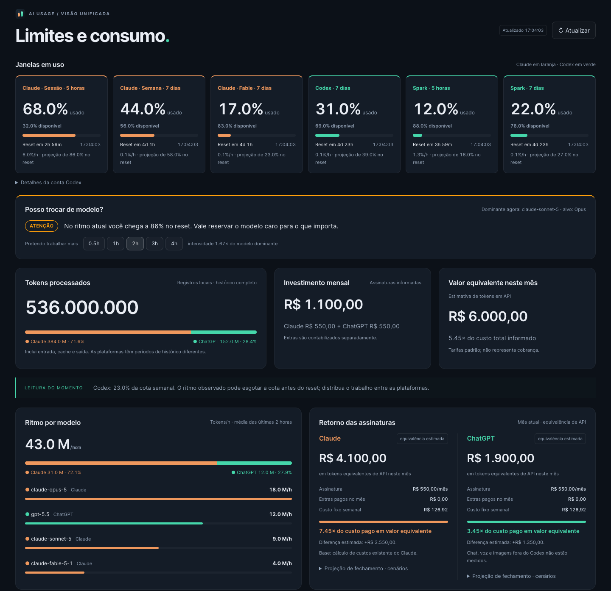
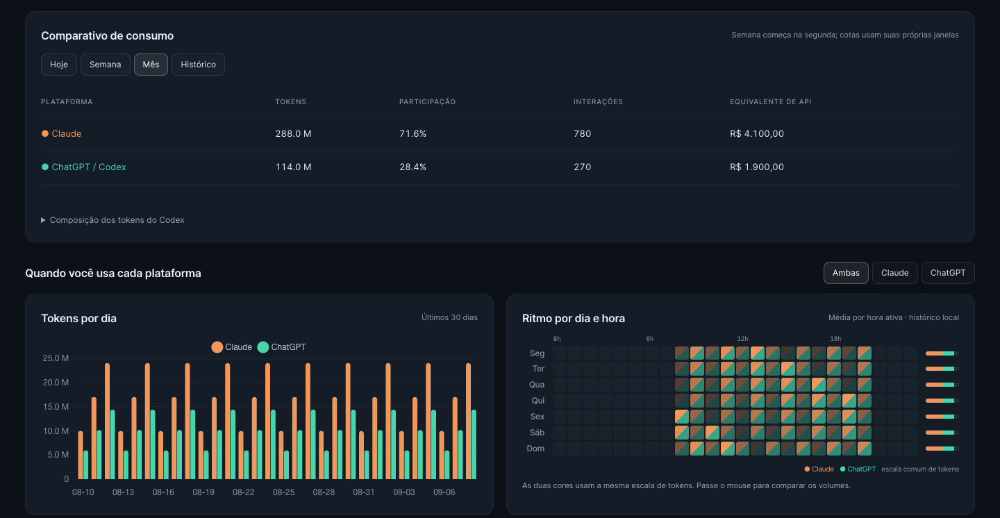
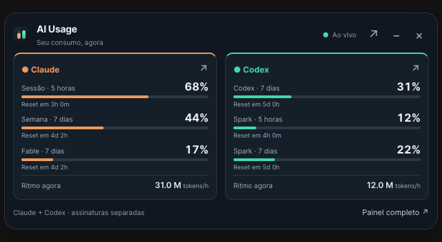

# AI Usage

Um painel local que acompanha separadamente a assinatura Claude e a assinatura
ChatGPT usada pelo Codex. Além do quanto você já consumiu, ele mostra **onde o
consumo vai chegar até o reset** se o ritmo continuar, e a partir disso responde
se dá para usar um modelo mais pesado agora ou se é hora de segurar.

## Sobre

Claude e Codex no mesmo painel: cotas em uso no topo, tokens separados por
plataforma, ritmo por modelo e comparação do consumo com o custo das assinaturas.

### As superfícies

Todas leem o mesmo backend local (`localhost:8090`); nenhuma consulta as contas
por conta própria.

| Superfície | O que é | Como abre |
| --- | --- | --- |
| **Backend + painel** | Coleta as cotas, guarda o histórico e serve a interface completa | `python3 main.py` → http://localhost:8090 |
| **Widget** | Versão enxuta com as cotas e o ritmo, para deixar de canto | http://localhost:8090/widget |
| **App de mesa** | Mac, Windows e Linux: o widget numa janela flutuante, com o motor embutido (não precisa de Python) | instalador da [página de releases](https://github.com/eueduardocampos/claude-usage/releases) |
| **App nativo do macOS** | Item na barra de menu com os números em texto, mais o widget em três formatos | `native-mac/` (veja [App nativo do macOS](#app-nativo-do-macos)) |
| **Stream Deck** | Oito teclas e quatro dials com cotas, ritmo e retorno | perfil + plugin em [`streamdeck/`](streamdeck/README.md) |

O número da versão é o mesmo em todas elas (arquivo [`VERSION`](VERSION)).



*Interface atual com dados demonstrativos. Cada instalação consulta suas próprias contas.*



*Claude em laranja e Codex em verde, na mesma escala de tokens.*


*Prévia renderizada das oito teclas e quatro dials; valores demonstrativos.*

## Fontes de dados

Ele junta duas fontes:

1. **Seus logs locais** (`~/.claude/projects`) → total de tokens da vida toda,
   médias por hora (geral / mês / semana / dia), custo estimado e ritmo de
   consumo por modelo.
2. **A API de uso da sua conta** (`/api/oauth/usage`) → % usada da **sessão (5h)**,
   da **semana (7d)**, dos **tetos semanais por modelo** quando a conta tem
   (ex.: "Semanal · Fable"), horários de reset e créditos de excedente.

As janelas por modelo chegam num formato diferente das outras (um array
`limits[]`, com o nome do modelo vindo do servidor), então o painel lê o que
vier em vez de trabalhar com uma lista fixa: quando a Anthropic acrescenta uma
janela nova, ela aparece sozinha. O que a API manda e o painel não reconhece
fica registrado no log, uma vez por inicialização, em vez de ser descartado em
silêncio.

Quando o Codex Desktop ou CLI está instalado, o painel também cria uma área
integrada para a **assinatura ChatGPT usada pelo Codex**. Os tokens são lidos de
`~/.codex/sessions`. A cota é consultada a cada cinco minutos usando o OAuth
existente em `~/.codex/auth.json`, sem copiar ou renovar credenciais. Snapshots
são guardados na tabela `codex_limits` do banco local por 90 dias.

O dashboard compara as plataformas com cores consistentes (Claude laranja,
ChatGPT verde), ritmo por modelo, cotas, histórico e equivalência de API.
A mensalidade é configurável, assim como compras extras no mês. Créditos não
são convertidos automaticamente em dinheiro. O cálculo de equivalência usa
preços padrão de texto verificados em 05/09/2026 e separa modelos sem preço.
Raciocínio já está incluído na saída; cache lido é cobrado separadamente da
entrada nova. Ferramentas, Fast e cache writes não registrados são excluídos.
Projeções de cota exigem 30 minutos na mesma janela; projeções financeiras
exigem três dias observados. Não há inferência de capacidade total por tokens.

Chat comum, imagens, voz e uploads não entram nesta medição.

Sessões importadas do Claude para o Codex são reconhecidas por
`~/.codex/external_agent_session_imports.json`. O histórico importado continua
contabilizado no Claude; se a conversa for retomada no Codex, apenas as novas
chamadas OpenAI entram na área ChatGPT.

Com isso, mostra um **semáforo por janela** e um **conselho direto** sobre a
situação: se sobra margem para usar um modelo mais pesado agora, ou se o ritmo
atual já não chega até o reset.

> ⚠️ **Projeto não-oficial.** Não tem relação com a Anthropic, a OpenAI ou a Elgato. Ele lê um endpoint
> de uso que não é documentado publicamente e pode mudar a qualquer momento.
> Use por sua conta e risco.

## Recursos

- 🔢 **Total absoluto de tokens da vida toda**, atualizando quase em tempo real.
- 🧾 **Licença vs consumo**: detecta seu plano pela API (Pro, Max, Time, Enterprise), compara o que você paga (tabela Brasil) com o consumo equivalente em preço de API e mostra se está compensando.
- 🔥 **Fonte dos tokens ao vivo**: dentro da licença ou queimando créditos extras — com gasto das últimas 24h e média por hora dos extras.
- 🚦 **Semáforo por janela** (verde < 80% projetado · amarelo 80–100% · vermelho ≥ 100%).
- 🔮 **Projeção até o reset** com base no ritmo medido de consumo, tanto no Claude
  quanto no Codex, e desenhada na própria barra.
- 🤖 **Conselho de modelo** combinando limite ao vivo + ritmo dos logs, escrito
  em termos de folga e aperto (não assume qual modelo você usa por padrão).
- 🔔 **Aviso de versão nova**, consultado uma vez pelo backend e mostrado em
  todas as superfícies.
- 📊 Gráficos de tokens por dia, perfil por hora do dia e evolução das janelas.
- ⏱️ **Ritmo adaptativo e seguro**: lê a API a cada 90s perto do limite e a cada 5 min com folga, com backoff em `429` e sem tratar limite de requisição como desconexão.
- 🖥️ **Interface unificada e responsiva**: cotas ativas em uma faixa, janelas zeradas recolhidas e cores por plataforma.
- 🪟 **Widget Claude + Codex** para macOS, Windows e Linux (sempre no topo, com ícone próprio) — veja [App de desktop](#app-de-desktop-macos-windows-e-linux).
- 🔒 Histórico armazenado localmente; consultas autenticadas vão aos serviços de cada conta.

## Stack

- **Frontend:** React + Vite + Tailwind CSS v4 + Chart.js.
- **Backend:** Python (só biblioteca padrão) — serve o build do frontend e expõe a API de estado/uso.
- **App de desktop (macOS/Windows/Linux):** [Tauri](https://tauri.app) (Rust) — janela flutuante nativa que exibe o widget. Veja a seção [App de desktop](#app-de-desktop-macos-windows-e-linux).
- **App nativo do macOS:** Swift + SwiftUI (Swift Package), cliente puro da API local. Veja [App nativo do macOS](#app-nativo-do-macos).

## Requisitos

Para **rodar** (a interface já vem compilada em `web/dist`):

- **Python 3.9+** (só biblioteca padrão). O macOS já traz 3.9 de fábrica, então
  serve sem instalar nada.
- **Claude Code e/ou Codex** já autenticados na máquina (CLI ou app).
- Conexão com internet (para a API de uso da conta).

Para **desenvolver a interface** (opcional): **Node.js 18+**.

## Instalação

```bash
git clone https://github.com/eueduardocampos/claude-usage
cd claude-usage
python3 main.py
```

No Windows, o comando é `python main.py`.

Por padrão, o painel sobe em **http://localhost:8090** e abre sozinho no navegador.

Três detalhes importantes:

- `localhost` é **a sua própria máquina**. Cada pessoa roda a sua instância, com os
  próprios dados e a própria conta. Não é um endereço público nem compartilhado, e
  ninguém de fora acessa o seu painel.
- Um clone não vem com `config.json` (ele está no `.gitignore`, porque guarda
  ajustes pessoais). O painel roda sem ele, nos valores padrão. Para ajustar
  qualquer coisa, copie o exemplo primeiro: `cp config.example.json config.json`.
- A porta (`8090`) é configurável em `config.json`, mas ela também está escrita
  no app de mesa, no plugin do Stream Deck e no app nativo. Se trocar, essas
  superfícies deixam de encontrar o painel até serem ajustadas junto.

Você também pode dar dois cliques num lançador, sem abrir terminal:
`iniciar-painel.bat` no Windows, `iniciar-painel.command` no macOS. Para
reconectar a conta, os equivalentes são `reconectar-conta.bat` /
`reconectar-conta.command`.

> 🍎 No macOS, o Gatekeeper barra o primeiro duplo-clique num `.command` baixado
> da internet. Libere com **botão direito → Abrir** uma vez, ou rode
> `xattr -d com.apple.quarantine iniciar-painel.command`.

> 💾 O banco local (`painel.db`) fica em `%LOCALAPPDATA%\claude-usage\` no Windows
> (ou `~/.local/share/claude-usage/` no macOS/Linux) e é migrado automaticamente
> na primeira execução. Rodar o banco em disco local é o que mantém a API
> respondendo em milissegundos mesmo com o código num drive sincronizado.
>
> Rodando pelo clone (`python3 main.py`), o `config.json` e o `token.json` ficam
> **na pasta do projeto**. Quem instala pelo app de mesa tem os três arquivos na
> pasta de dados do usuário (veja [Conectar as contas](#conectar-as-contas)).

## App de desktop (macOS, Windows e Linux)

A partir da versão **3.0**, o instalador inclui o painel, a interface e o Python
necessário para executá-lo. Abra **AI Usage**: o motor inicia automaticamente e
o widget aparece, com Claude e Codex lado a lado. Clique no ícone, em uma conta
ou em **Painel completo** para abrir a versão web no navegador. Não precisa de terminal, Python ou Node instalados.

### Instalar pelo release

Baixe na [página de releases](https://github.com/eueduardocampos/claude-usage/releases):

| Sistema | Arquivo |
| --- | --- |
| Mac Apple Silicon (M1 ou posterior) | `.dmg` com `aarch64` no nome |
| Mac Intel | `.dmg` com `x64` no nome |
| Windows 10/11 64 bits | `setup.exe` ou `.msi` |
| Linux 64 bits | `.AppImage`, `.deb` ou `.rpm` |

No Mac, arraste para Aplicativos. No Windows, siga o instalador. No Linux,
instale o pacote da sua distribuição ou dê permissão de execução ao AppImage.
Os instaladores ainda não são assinados/notarizados: macOS e Windows podem
pedir liberação de segurança na primeira abertura. O AppImage pode precisar de FUSE.

O aplicativo usa a porta local **8090**, também consumida pelo Stream Deck.
Se encontrar uma instância compatível, reutiliza-a. Se a porta estiver ocupada
por outra aplicação ou uma versão antiga, mostra uma mensagem para resolver.
Use **Sair** no menu da bandeja para encerrar o motor iniciado pelo app.

### Identidade do aplicativo



O ícone e o visual fazem parte do aplicativo e já vêm em todos os instaladores.
Laranja identifica Claude; verde identifica Codex no desktop, no painel web e
no Stream Deck. Não é necessário criar, escolher ou substituir ícones.

### Conectar as contas

O instalador não inclui contas nem histórico. Conecte Claude nas configurações
do painel ou use o login existente do Claude Code. Para Codex, entre com sua
assinatura ChatGPT no Codex Desktop/CLI nessa máquina. Os tokens aparecem à
medida que esses aplicativos são usados. Chat comum, voz e imagens não são medidos.

Configuração, token e banco ficam na pasta de dados do usuário, fora da instalação:

- macOS: `~/Library/Application Support/claude-usage/`
- Windows: `%LOCALAPPDATA%\claude-usage\`
- Linux: `$XDG_DATA_HOME/claude-usage/` ou `~/.local/share/claude-usage/`

### Desenvolver e gerar instaladores

No ambiente de desenvolvimento, instale Python, Node e Rust. Então execute:

```bash
npm --prefix web ci
npm --prefix web run build
python -m pip install pyinstaller==6.22.2 certifi
python desktop/packaging/build.py
python desktop/packaging/smoke.py
cd desktop
npx @tauri-apps/cli@2 dev
npx @tauri-apps/cli@2 build
```

O GitHub Actions gera cada pacote no sistema e arquitetura correspondentes,
verifica o motor com HOME temporário e PATH vazio, e só publica o release quando
todos os builds passam. Versões 2.x continham apenas o widget e exigiam iniciar
o backend separadamente; não oferecem essa instalação autônoma.

## App nativo do macOS

Um app de barra de menu escrito em Swift/SwiftUI, em [`native-mac/`](native-mac/).
Diferente do app de mesa, ele **não** embute o motor: é um cliente do painel que
já estiver rodando na máquina.

- Mostra as métricas **como texto na própria barra** (ex.: `5h 68% · 7d 44%`),
  com o ícone tingido pelo semáforo. Em Preferências (⌘,) você escolhe quais
  cotas aparecem ali.
- O widget tem três formatos: **Padrão** (Claude e Codex lado a lado),
  **Vertical** (empilhado, para encostar na lateral da tela) e **Compacto**
  (uma linha por cota). Cada um guarda posição e tamanho próprios.
- No menu: atualizar agora, reconectar a conta, abrir ao iniciar sessão e o
  aviso de versão nova.

```bash
cd native-mac
swift run                 # roda direto
./build-app.sh            # gera .build/AIUsageWidget.app
```

Também dá para abrir o `native-mac/Package.swift` no Xcode e rodar por lá. O
`.app` gerado tem assinatura ad-hoc: em outra máquina, o macOS pede **botão
direito → Abrir** na primeira vez.

## Stream Deck

O plugin **AI Usage** acompanha Claude e Codex com o perfil diário
**Consumo de IA** para Stream Deck +. Cotas e cobrança na primeira linha;
ritmo e retorno mensal na segunda. Os dials alternam janelas, modelos,
equivalência de API e totais. As ações e os perfis anteriores continuam disponíveis.

Baixe o [perfil Consumo de IA](streamdeck/Consumo%20de%20IA.streamDeckProfile)
e siga a [instalação do plugin](streamdeck/README.md#instalar).

### iOS

Uma versão para **iPhone/iPad** está no radar para o futuro. O backend e a
interface já são compartilhados, então o caminho é levar o mesmo widget para um
app iOS — ainda sem data definida.

## Desenvolvimento da interface

A interface fica em `web/` (React + Vite). O build versionado em
`web/dist` é o que o `python3 main.py` serve — por isso quem só quer **usar** não
precisa de Node. Para **mexer na interface**:

```bash
cd web
npm install
npm run dev          # Vite em http://localhost:5173 (com a API do Python via proxy)
npm run build        # regera web/dist (rode antes de commitar mudanças de UI)
```

No `npm run dev`, deixe o backend rodando em paralelo (`python3 main.py`) para a
API responder.

## Testes

Os testes são scripts soltos, sem framework: cada um imprime `TUDO PASSOU` ou
sai com erro. É o que o CI roda.

```bash
for t in test/test_*.py; do python3 "$t" || break; done
node streamdeck/test/unified.js
node streamdeck/test/fake_sd.js
```

Os prints do README são gerados com dados de demonstração (nenhuma conta real é
lida) e o gerador também confere que o widget não transborda e que o console
fica limpo:

```bash
CHROME_CHANNEL=chrome node docs/capture.mjs
```

## Autenticação

Na primeira execução o painel tenta reaproveitar a credencial do Claude Code
(`~/.claude/.credentials.json`). Se ela não servir, clique em **"Reconectar conta"**
no painel (ou rode `python auth.py login`): abre uma aba no navegador para você
autorizar via OAuth. O token fica salvo localmente em `token.json` e é renovado
automaticamente — **independente do Claude Desktop**.

## Como funciona o alerta

- **Projeção:** usa a velocidade medida (%/hora) quando há amostras suficientes
  (≥ 30 min de coleta); antes disso, usa a média desde a abertura da janela. Uma
  queda no valor é lida como reset da janela, não como consumo negativo. Vale
  para as janelas do Claude e para as do Codex, pelo mesmo cálculo.
- **Conselho de modelo:** projeta o mesmo ritmo aplicando um fator de
  intensidade (a razão entre o preço de saída dos modelos) sobre a sessão (5h),
  a semana (7d) e, quando existe, o teto semanal do próprio modelo. O texto fala
  de "modelo mais pesado" e "modelo mais leve" em vez de nomear um modelo, porque
  o padrão de cada pessoa é diferente. É uma **estimativa** e fica mais precisa
  conforme o painel coleta amostras.

## Configuração

Copie `config.example.json` para `config.json` e ajuste o que quiser:

| Campo | Descrição |
|---|---|
| `port` | Porta do painel (padrão 8090). Veja a ressalva em [Instalação](#instalação) |
| `open_browser` | Abrir o navegador sozinho ao iniciar (padrão `true`) |
| `callback_port` | Porta do callback do login OAuth (padrão 54545) |
| `currency` | Moeda de exibição do painel (ex.: `BRL`) |
| `usd_brl` | Câmbio fixo. Vazio = cotação automática, atualizada a cada hora |
| `credits_divisor` | Divisor dos créditos (a API costuma vir em centavos → 100) |
| `daily_days` | Quantos dias o gráfico diário mostra (padrão 30) |
| `intended_hours` | Quantas horas você pretende trabalhar, usado no conselho de modelo |
| `subscription_brl` | Mensalidade do Claude, para o comparativo de retorno |
| `chatgpt_subscription_brl` | Mensalidade do ChatGPT |
| `chatgpt_extra_brl` | Compras extras de Codex no mês atual |
| `plan` | Força o plano detectado (`max_20x`, `pro`...) quando a detecção erra |
| `switch_target` | Fixa o modelo usado como referência de "mais pesado" no conselho |
| ~~`refresh_seconds`~~ | Não é mais configurável: o ritmo do poll é adaptativo (veja abaixo) |

Os três valores em reais e as horas pretendidas também são editáveis pela
própria interface, sem mexer no arquivo.

## Por que o intervalo da API é fixo

O limite de requisições vale para a **conta inteira** — cada sessão aberta do
Claude Code soma no mesmo balde. Um intervalo curto no painel não traz
informação nova (as janelas de uso se movem devagar) e ainda ajuda a estourar o
limite. Por isso o poll tem **ritmo adaptativo** — 90s quando alguma janela passa de
80% (a faixa em que 1 ponto muda decisão), 3 min entre 50–80% e 5 min com folga.
E quando vem um `429` o painel:

- **não** marca a conta como desconectada — o token continua válido, então pedir
  reconexão só geraria mais requisições e pioraria o problema;
- espera com backoff exponencial (5 → 10 → 20 min, teto de 30), respeitando o
  `Retry-After` quando o servidor manda;
- mantém na tela o último dado bom, avisando "limite da conta · nova tentativa
  em Xs".

O contador de tokens, o custo e os gráficos continuam atualizando a cada 10s,
porque vêm do scan dos **logs locais** e não gastam requisição nenhuma.

## Privacidade e segurança

- Tudo roda em `localhost`. Os custos em USD são **estimativa** pela tabela de
  preço da API; em assinatura, o que é cobrado é o excedente mostrado no painel.
- `token.json` guarda o token OAuth da sua conta. Ele está no `.gitignore` e
  **nunca** deve ser compartilhado nem versionado.

## Contribuições

Este é um **projeto pessoal** e **não aceita contribuições externas**. Pull
requests de terceiros são fechados automaticamente. Fique à vontade para **usar,
clonar e dar fork** e adaptar para o seu uso.

## Licença

[MIT](LICENSE) © 2026 Eduardo Campos
